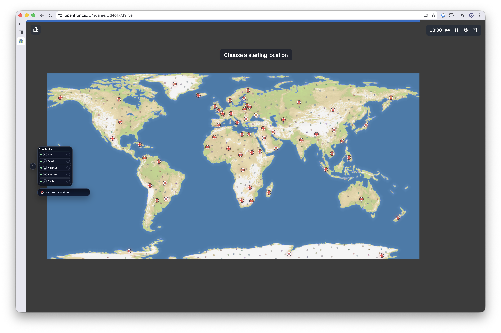

# OpenFront Enhanced

Chrome extension that adds quality-of-life improvements to [openfront.io](https://openfront.io) and [openfront.dev](https://openfront.dev).

## Features

### Spawn phase
- **Nation markers** — Red dots on nations during spawn selection, visible at any zoom level. Removed when the game starts.
- **Sound notifications** — A chime plays when the spawn phase begins and another when the game starts, so you don't have to stare at the screen.

### Sound alerts
- **Per-sound settings** — Every OFE sound has its own toggle in the Extension settings tab, plus a `Listen` button so you can preview it without waiting for the in-game event.
- **Transport ship sounds** — A distinct sound plays when one of your transport ships lands, and a different sound plays when one is destroyed.
- **Warship destroyed sound** — A separate alert plays when one of your warships is destroyed.
- **Neighbor alerts** — Sleeping neighbors and traitor neighbors each have their own sound and setting.
- **Missile alerts** — Separate alarms play for atom bombs, hydrogen bombs, and MIRVs.

### Territory cycle
- **Mini Territories cycle** — The `Mini Territories` shortcut cycles the camera through your disconnected mini territories (100 tiles or fewer), skipping the shortcut if your land is fully connected or there are no mini territories.

### Keyboard shortcuts

All shortcuts are rebindable in the extension's `Extension` settings tab.

| Default key | Action | Description |
|---|---|---|
| `Z` | Chat Search | Opens chat directed at the hovered player with search |
| `X` | Emoji Search | Opens emoji selector with keyword search |
| `V` | Alliance Request | Sends an alliance request to the hovered player |
| `N` | Boat 1% | Sends a boat attack using only 1% of your troops |
| `L` | Mini Territories | Jumps camera between your disconnected mini territories (100 tiles or fewer) |

### Neighbor alerts
Notifications appear in the bottom-right when a neighboring player:
- **Falls asleep** (disconnects)
- **Betrays** an alliance and becomes a traitor

### Other
- **Emoji priority & keyword search** — Frequently used emojis are boosted to the top, and all emojis are searchable by keyword.

## Installation

1. Download or clone this repository
2. Open `chrome://extensions` in Chrome
3. Enable **Developer mode** (toggle in the top-right corner)
4. Click **Load unpacked**
5. Select the `extension/` directory

The extension will activate automatically when you visit `openfront.io`, `openfront.dev`, or any `*.openfront.dev` subdomain.

## Contributing

Found a bug or have a feature idea? [Open an issue](../../issues/new/choose).
